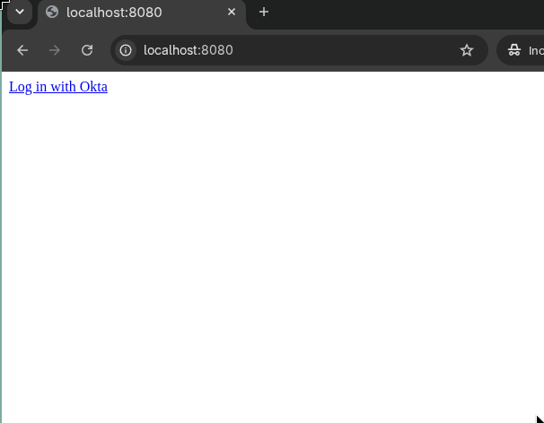
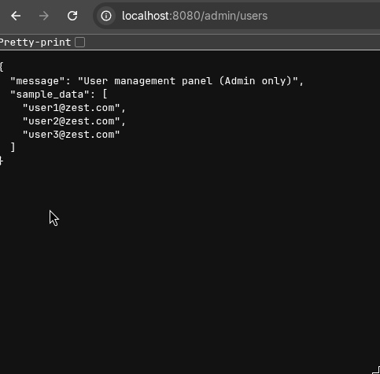
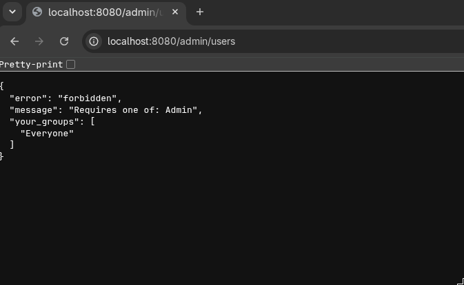

Zest Admin Portal

An internal workforce identity portal for the Zest nutrition app, this project demonstrates enterprise Identity and Access Management (IAM) principles. It includes single sign-on (SSO), role-based access control (RBAC), and layered authentication/access policies. This repository is built to manage the employee side of the consumer app. 

Skills demonstrated

* OIDC and OAuth2 authorization code flow, SSO login via Okta as the identity provider.
* RBAC via group claims
* Separation of Authentication (AuthN) versus Authorization (AuthZ)

Screenshots 
### Okta login
 

### Admin dashboard

### RBAC enforcement - 403 forbidden for unauthorized role
 

Running locally

bash 

git clone git@github.com:bcuellarb23/Zest-iam-admin-portal.git  
cd Zest-iam-admin-portal  
python3 -m venv venv  
source venv/bin/activate       # Windows: venv\Scripts\activate  
pip install -r requirements.txt  
cp .env.example .env           # then fill in your own Okta app credentials  
python3 app.py  

Visit http://localhost:8080 and log in with an Okta account assigned to this app.

Environment variables .env

OKTA_CLIENT_ID = Client If from Okta app integration  
OKTA_CLIENT_SECRET = Client secret from Okta app integration  
OKTA_ISSUER = Okta authorization server issuer 
FLASK_SECRET_KEY = ramdom string used to sign Flask session cookies  
